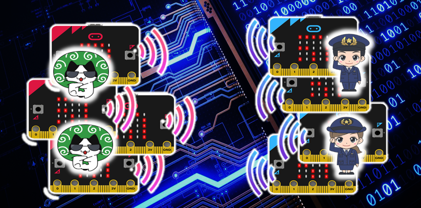

# high-low

### server.js

警官、泥棒からの送信データを集計するmiacrobit-集計.hexと
シリアル通信するWebsocketサーバーWebSocketサーバーです。 

起動方法： node server.js  [COMポート名]

- 接続用のポート番号は「80」固定です。
- 他のポート番号を使うときは、server.jsを修正してください。
- また、シリアル通信するポートは「COM1」ですが、
異なるポートを使うときは引数で指定するか、
server.jsを修正してください。
- COMポートのスピードは「115200」です。
- 停止は、「CTRL+C」で終了させてください。

### index.html

警官、泥棒からの送信データを表示するためのHTMLです。 
server.jsを動作させたあと、ブラウザで「http://localhost」を開いてください。
